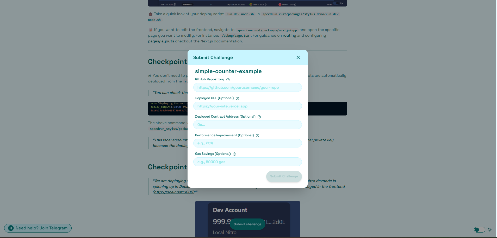
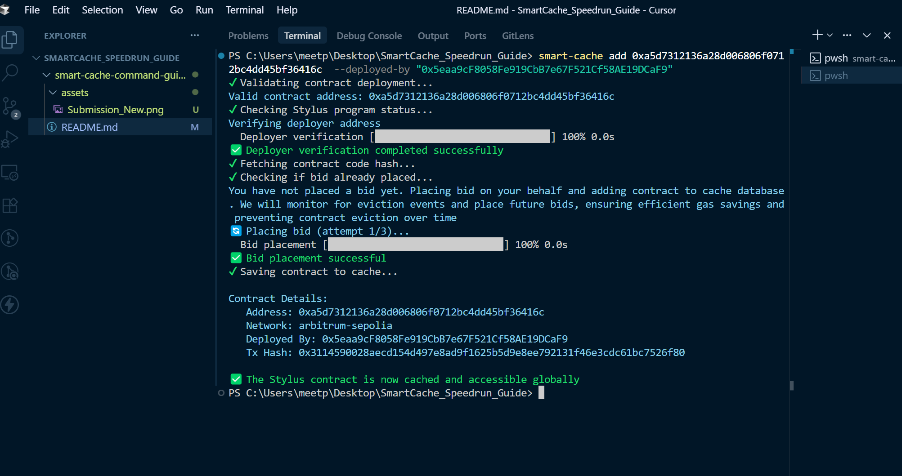

# smart-cache-command-guide

## Step 1: Set Up Your Repository for the Speedrun Challenge

If you have already completed the first challenge for the speedrun and have your code locally, open it in your preferred IDE (such as Cursor or VSCode). Then, run the following command to check your git remotes:

```sh
git remote -v
```

If you do not see `origin` set to `https://github.com/abhi152003/speedrun_stylus.git`, set it using:

```sh
git remote add origin https://github.com/abhi152003/speedrun_stylus.git
```

Or, if you need to update the remote:

```sh
git remote set-url origin https://github.com/abhi152003/speedrun_stylus.git
```

After setting the remote, pull the branch you are working on (for example, if you are working on the `counter` branch):

```sh
git pull origin counter
```

**If you have completed the first counter challenge and deleted your local repository, you can clone the `counter` branch directly from Abhi's repository:**

```sh
git clone -b counter https://github.com/abhi152003/speedrun_stylus.git speedrun_stylus_counter
```

This will create a new folder named `speedrun_stylus_counter` with the code from the `counter` branch.

## Step 2: Install Dependencies and Start the Local Devnode (for Windows/WSL Users)

If you are on Windows and using WSL, follow these commands to set up your environment:

```sh
cd speedrun_stylus
yarn install
```

Start the local devnode in Docker:

```sh
cd packages/stylus-demo
bash run-dev-node.sh
```

## Step 3: ⚠️ Important: Contract Address Setup

After running the devnode script, **copy the contract address** from the bash terminal output. You will need to paste this address into the `contractAddress` variable in the `DebugContract` component.

> 💡 **Note**: If both contract addresses are the same, you don't need to do anything - you're ready to go and interact with the stylus-based smart contracts written in RUST!


<p align="center"><em>Docker_Img</em></p>

## Step 4: 📊 Performance Tracking

Before submitting your challenge, you can run the performance tracking script to analyze your application:

1. **Navigate to the performance tracking directory:**

   ```bash
   cd packages/nextjs/services/web3
   ```

2. **Update the contract address:**
   Open the `performanceTracking.js` file and paste the contract address that was deployed on your local node. (You can get the contract address as mentioned above in Docker_Img)

3. **Run the performance tracking script:**
   ```bash
   node performanceTracking.js
   ```

This will provide insights about the savings when you cache your deployed contract. The output will show performance analysis similar to the image below:

<!--  -->


> 📝 **Important**: Make sure to note down the **Latency Improvement** and **Gas Savings** values from the output, as you'll need to include these metrics when submitting your challenge.

## Step 5: Deploy to Arbitrum Sepolia and Submit Your Challenge

> **Before deploying to Arbitrum Sepolia, make sure your wallet has some Sepolia ETH to cover deployment costs.**

If you are on Windows, run the following command in WSL to deploy your contract to the Arbitrum Sepolia testnet:

```sh
cargo stylus deploy --endpoint='https://sepolia-rollup.arbitrum.io/rpc' --private-key="<YOUR_PRIVATE_KEY_WITH_0x_PREFIX>"
```

After running the above command, **note down the contract address** you receive. This is the address you will use for your challenge submission (do **not** use the contract address from Docker; use the one generated by this deploy command).

> **Note:** If you cloned the repository again in Step 1, you do **not** need to push this latest code again. You should use the same GitHub repository URL that you have already submitted for this challenge, as you have already completed the challenge and the repo is already on GitHub.

### Submitting Your Challenge
When submitting your challenge, you will need to provide:
- Your GitHub repository URL (use the same repo you used for the counter challenge; if you deleted your code, re-clone and use the same URL)
- The deployed contract address from the Sepolia deployment (from the command above)
- The **Gas Savings** value
- The **Latency Improvement** value

Make sure you do **not** use the contract address from Docker for submission—only use the Sepolia address generated by the deploy command.

Below is an example of the updated submission form on the Speedrun website, so you know what to expect:



## Step 6: ⚡️ Cache Your Deployed Contract for Faster, Cheaper Access

> 📖 Contracts deployed on Arbitrum Sepolia can use this command for gas benefits, time savings, and cheaper contract function calls

Before caching your contract, make sure you have installed the Smart Cache CLI globally:

```bash
npm install -g smart-cache-cli
```

> 💡 **Info:** Both the `<address>` and `--deployed-by` flags are **mandatory** when adding a contract to the cache.

### 📝 Simple Example

```bash
smart-cache add <CONTRACT_ADDRESS> --deployed-by <YOUR_WALLET_ADDRESS_WITH_WHOM_YOU_HAVE_DEPLOYED_CONTRACT>
```

- `<CONTRACT_ADDRESS>`: The address of your deployed contract (**required**)
- `--deployed-by`: The wallet address you used to deploy the contract (**required**) - means the wallet address of the private key you have used to deploy the contract on arbitrum sepolia while running the command cargo stylus deploy
- `--network arbitrum-sepolia`: By default, contracts are cached for the Arbitrum Sepolia network for optimal benchmarking and compatibility

> ⚠️ **Warning:** If you omit the required fields, the command will not work as expected.

> 💡 For more options, run `smart-cache add --help`.

---

For more details, you can also see the published package on npmjs: [smart-cache-cli](https://www.npmjs.com/package/smart-cache-cli)

---

After running the `smart-cache add` command, you should see output similar to the example below, so you know what to expect:



---